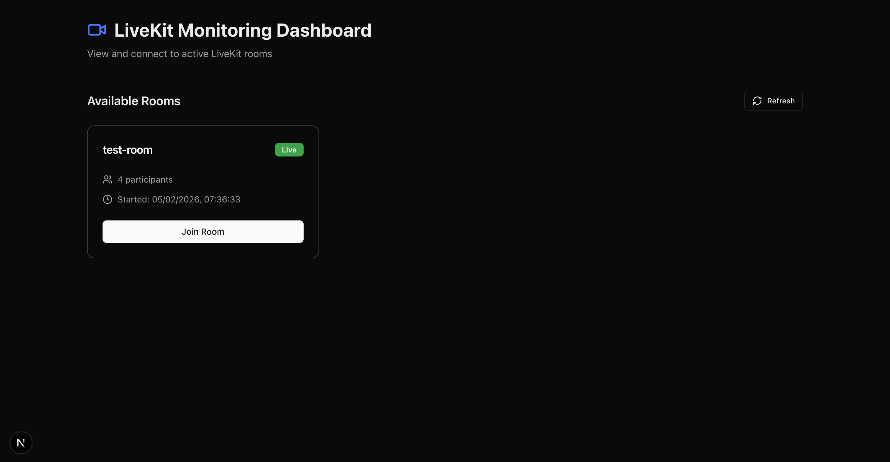
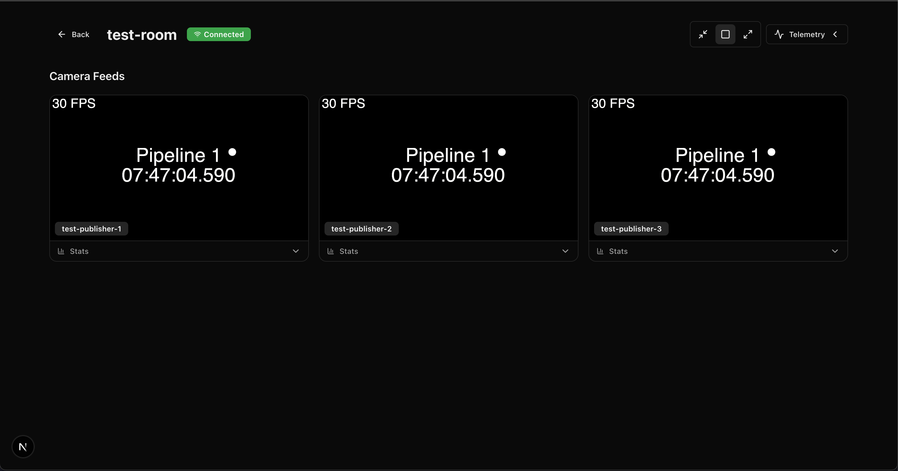

# LiveKit Monitoring Dashboard

A Next.js application for monitoring and connecting to LiveKit rooms. View camera feeds and receive telemetry data in real-time.




## Features

- **No Server Configuration Required**: Enter your LiveKit credentials directly in the UI
- **Room Listing**: View all active LiveKit rooms on the landing page
- **Video Grid**: Subscribe to and display camera feeds from connected devices
- **RTC Stats**: View detailed WebRTC statistics for each video track
- **Telemetry Panel**: Real-time telemetry data visualization with:
  - Message rate (Hz)
  - Message size statistics
  - Rolling message stream

## Prerequisites

- Node.js 20.9.0 or higher
- pnpm
- A LiveKit server (cloud or self-hosted)

## Setup

1. Clone the repository and install dependencies:

```bash
pnpm install
```

2. Run the development server:

```bash
pnpm dev
```

3. Open [http://localhost:3000](http://localhost:3000) in your browser

4. Enter your LiveKit credentials when prompted:
   - **LiveKit URL**: Your LiveKit server WebSocket URL (e.g., `wss://your-server.livekit.cloud`)
   - **API Key**: Your LiveKit API key
   - **API Secret**: Your LiveKit API secret

## Environment Variables

| Variable                | Required | Description                                                   |
| ----------------------- | -------- | ------------------------------------------------------------- |
| `IRON_SESSION_PASSWORD` | Yes      | 32+ character secret for encrypting session cookies           |
| `LIVEKIT_URL`           | No       | LiveKit server WebSocket URL — auto-seeds the credential form |
| `LIVEKIT_API_KEY`       | No       | LiveKit API key — auto-seeds the credential form              |
| `LIVEKIT_API_SECRET`    | No       | LiveKit API secret — auto-seeds the credential form           |

When all three `LIVEKIT_*` variables are set the dashboard skips the credentials form and connects automatically.

## Testing with GStreamer

You can publish a test H264 video stream to a LiveKit room using GStreamer and the [LiveKit CLI](https://docs.livekit.io/intro/basics/cli/).

### Prerequisites

```bash
# GStreamer (Ubuntu/Debian)
sudo apt-get install -y gstreamer1.0-tools gstreamer1.0-plugins-base \
  gstreamer1.0-plugins-good gstreamer1.0-plugins-bad \
  gstreamer1.0-plugins-ugly gstreamer1.0-libav

# LiveKit CLI
curl -sSL https://get.livekit.io/cli | bash
```

### 1. Create a room

```bash
export LIVEKIT_URL=wss://your-server.livekit.cloud
export LIVEKIT_API_KEY=your-api-key
export LIVEKIT_API_SECRET=your-api-secret

lk room create --name my-room
```

### 2. Start a GStreamer H264 pipeline

This launches a test pattern (bouncing ball + timestamp) encoded as H264 and served over TCP:

```bash
gst-launch-1.0 videotestsrc pattern=ball is-live=true \
  ! video/x-raw,width=1280,height=720,framerate=30/1 \
  ! timeoverlay \
  ! x264enc bitrate=2000 speed-preset=ultrafast key-int-max=30 \
  ! video/x-h264,stream-format=byte-stream \
  ! tcpserversink host=127.0.0.1 port=5000
```

### 3. Publish to LiveKit

In a second terminal, consume the TCP stream and publish it as a camera track:

```bash
lk room join --identity gstreamer-publisher \
  --publish "h264://127.0.0.1:5000" --fps 30 my-room
```

### 4. View in the dashboard

Open `http://localhost:3000`, find the room, and click **Join Room** to see the live video feed with WebRTC stats.

## Security

- **Session Storage Only**: Credentials are stored in your browser's session storage
- **Cleared on Tab Close**: Credentials are automatically cleared when you close the browser tab
- **No Server Storage**: Credentials are never stored on the server - they are passed per-request
- **Direct Connection**: Credentials are only sent to your own LiveKit server

## Production

Build and run:

```bash
pnpm build
pnpm start
```

## Architecture

### API Routes

- `POST /api/rooms` - List all active LiveKit rooms (requires credentials in body)
- `POST /api/token` - Generate a viewer token for joining a room (requires credentials in body)
- `GET /api/healthz` - Health check endpoint

### Data Channels

The app subscribes to a data channel named `telemetry` for receiving telemetry data. The telemetry panel displays:

- Current message rate (Hz)
- Average message size
- Total message count
- Real-time message stream

### Viewer Mode

The dashboard operates in viewer-only mode:

- Subscribers do not publish video/audio
- Only camera feeds from livekit rooms are displayed
- The local participant is excluded from the video grid

## Tech Stack

- **Framework**: Next.js 16 with App Router
- **API**: Hono
- **LiveKit**: livekit-server-sdk, livekit-client, @livekit/components-react
- **Styling**: Tailwind CSS
- **Validation**: Zod
- **Package Manager**: pnpm
